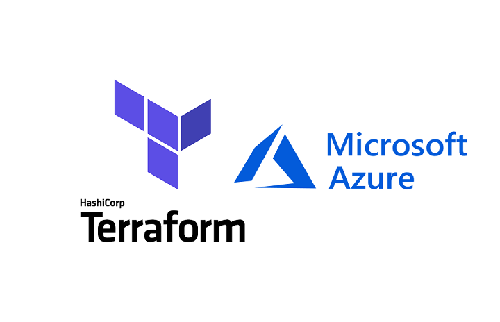

# Udemy Terraform Azure



A repository used for the Udemy course: Learning Terraform on Microsoft Azure.

# Usage

Initialize the modules, backend, and provider plugins.

```
PS C:\Users\Massimo\repos\udemy-terraform-azure> terraform init
Initializing modules...
- web_server_eastus in web-server
- web_server_westus in web-server

Initializing the backend...     

Initializing provider plugins...
- Checking for available provider plugins...
- Downloading plugin for provider "azurerm" (hashicorp/azurerm) 1.44.0...
```

Deploy multi-location web service

```
PS C:\Users\Massimo\repos\udemy-terraform-azure> terraform apply

An execution plan has been generated and is shown below.
Resource actions are indicated with the following symbols:
  + create

Terraform will perform the following actions:

Plan: 31 to add, 0 to change, 0 to destroy.

Do you want to perform these actions?
  Terraform will perform the actions described above.
  Only 'yes' will be accepted to approve.

  Enter a value: yes

Apply complete! Resources: 31 added, 0 changed, 0 destroyed.
```

# License

This repository is licensed under the **GNU General Public License v3.0** - see
the [LICENSE](LICENSE) file for details.

# Acknowledgments

[Learning Terraform on Microsoft Azure](https://www.udemy.com/course/learning-terraform-on-microsoft-azure/)